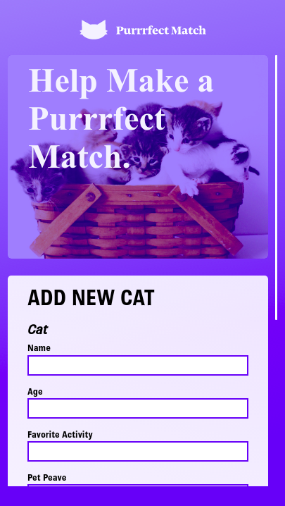

# Purrrfect Match

Frontend test project built using:
- React
- Redux
- Redux-saga
- Plain CSS (without styling libraries)
- Responsiveness implemented with flexbox, css grid and media queries
- Data fetched from [The Cat API](https://docs.thecatapi.com/)
- Tests of components `CatBreed` and `CatList` with Jest/Enzyme
- Hosted on GH Pages: https://diegowendel.github.io/purrrfect-match/

## Pages

### List Page


|      List Page Mobile 1      |      List Page Mobile 2      |
| :--------------------------: | :--------------------------: |
|  |  |

### Form Page


|      Form Page Mobile 1      |      Form Page Mobile 2      |
| :--------------------------: | :--------------------------: |
|  |  |

### View Page


|      View Page Mobile 1      |      View Page Mobile 2      |
| :--------------------------: | :--------------------------: |
|  |  |


## Running Project

Clone the project and on the root folder install the dependencies

```
npm install
```

Create a file named `.env` on the project root folder and add the following var to it:

```
REACT_APP_API_KEY=YOUR_KEY_FROM_CAT_API_HERE
```

Start the app

```
npm start
```

## Running tests

On the root folder, run:

```
npm test
```